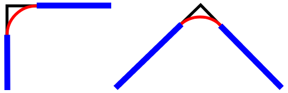

# Track Maker

This repository hosts a tool I made for the purpose of designing 3D printable
tracks to fit LED strips in when making wall mounted neon-like LED logos. I am
using white / natural LED-color strips which silicone sleeves giving them color.

I make these logos by tracing over a reference, designing the tracks, gluing
them onto an acrylics sheet, fitting the LED strips in them, soldering them
together to a connector and drilling/soldering mounting holes into the acrylic.
They run off a commodity 12 V wall charger terminal with a barrel jack.

## Development

When in development, I use this application off a file opened in Firefox through
the `file:` protocol. This would ordinarily pose issues with CORS and ESM, so I
turn the Firefox setting `security.fileuri.strict_origin_policy` off. It can be
toggled in `about:config`. **Note:** This will disable CORS for all `file:`
protocol files, so do not disable this and open file you don't trust in Firefox.
Ideally, only ever open your own files in Firefox over the `file` protocol.

## Notes

The main feature of this program is supposed to be a method for drawing an arc
between two points with the minimal amount of effort and inputs. For example,
when tracing a box, which has corners that are too sharp for the LED strip to
bend to conform to them, one has to introduce a fillet so that the track has
a quarter-circle where the sharp corner is in the reference. I want to have a
command which accepts relative X and Y where the quarter circle should end and
have it works out how to draw that quarter circle between the two points.

At the same time, the arcs won't always be filleted corners. Some references
might have spiky bits where again, the LED strip cannot be bent enough to be
able to follow those exactly, which means the spikes need to be smoother out.

This command should be able to do both of this:

However as I research this, I am realizing that this will likely not be possible
just by providing two points, because the slopes of the lines the arc is between
are required information for this to work. And it would not work for specifying
multiple arcs that follow one directly into another.

So, the canvas APIs I see available, `arcTo`, `arc`, `quadraticCurveTo`,
`bezierCurveTo`, `ellipse` etc. will all need some sort of a control point or
another kind of information to be able to determine how to arc exactly so that
the motion smooths into the previous shape (line or another atc).

I am still in the progress of doing research on this, but as of now, I am pretty
sure `quadraticCurveTo` and `bezierCurveTo` won't be of use, because neither (?)
can form a quarter circle, which is needed for the corner case, but `ellipse`
alone (to make a circle) might not be able to handle it either. I will probably
be best of implementing all of these and adding interactive handles to the
canvas so that I can trace them to match the desired shape easily.

Another angle might also be focusing on building a good tracing tool, rounding
spikes aside, and then to come up with an algorithm that would smooth the spikes
automatically by providing some minimal radius a spike can be. This would be
difficult or maybe impossible mathematically: I have no idea how I would go
about finding a center and arc angles of a circle which fits between two curves
so that their connection has this minimal radius. But it would probably be
doable by treating everything as polylines and just brute-forcing the solution
that way. Basically, render everything as a bunch of polylines, even if traced
using curve tools and then for each corner, go through pairs of lines among the
polyline segments within that diameter and see what two lines would give the
closest result if a circle of the minimal radius was placed between them.

Even if I figured this solution mathematically, I still don't know whether GCode
OpenSCAD has corresponding arc/ellipse commands I could translate it to and STL
is triangles only, so I will need both discrete and continuous solutions or just
the discrete one if I decide to drop GCode import and generate GCode with lines
only and no curves.

## To-Do

### Tweak the `arc` or `quadraticCurve` commands to achieve the arc I want

**Note:** This not not up to date with respect to the notes above. I need to do
more research and then I will update both the notes and this task.

I want to have a command which draws an arc from the current cursor position to
the point specified by the relative x and y provided to the command. It should
calculate the radius needed for the arc to connect to both of the points by
itself.

This problem has infinitely many solutions, because the arc's radius can differ
while still meeting the requirement of touching both of the points. It is kind
of like having a balloon and sitting it on top of two straws. As the baloon
expands, the points at which it touches the straws will remain constant, but
the length of arc that the baloon creates between the two straws will be smaller
and smaller fraction of the circumference of the whole baloon.

I would like to default this radius to a value which will make the the arc be a
quarter of a circle. This will be as if the two points created a corner and we
expanded the baloon to fit snugly in that corner. Any less and it would not
touch both of the points. Any more and it would get pushed away from the corner
by the walls, or alternatively, if there were no walls, it would bulge out past
the corner.

To tweak the implicit automatically calculated radius, the user could provide an
optional argument, which would be an offset to the calculated radius to make it
bigger. Negative values would not be supported - that would mean a radius too
small for the arc to be able to touch both points.

Another optional argument will be a boolean flag about whether the "corner" made
by the two points should be the alternative solution. This is because any two
points can be connected by two isosceles right triangles - two corners. We will
default to one where calculating the third point is done by increasing both axes
in the positive direction, the other one has one of the axes going in a negative
direction.

There is this resource which seems to have the right math:
https://stackoverflow.com/a/58824801/2715716

But it works out arguments for the Windows API for drawing an arc which differs
from the web API. I will need to bridge that gap.

It might be possible that neither `quadraticCurveTo` nor `arcTo` will be able to
produce the desired result (I am not sure if either can make a quarter circle),
in which case I still need to figure this out, but there are a few more concerns
relating to both display and export:

- What to use for display of true quarter circle? A polyline with many segments?
  - The number of segments could be the larger side of the bounding box to get
    the desired smoothness in the preview
- What to do about GCode export? Does it have arc or circle/ellipse commands?
  If so, I would like to use those, but maybe I will need to do it the same way
  I expected I will need to do OpenSCAD and STL: by using a fat polyline.

### Implement OpenSCAD/STL/GCode export

I am not sure if OpenSCAD can do true arcs, or STL for that matter, but GCode
does. I however further do not know if 3D printers actually implement that arc
instruction. There may be optimizations doable such that the arc is true and is
preserved in the OpenSCAD/STL and remains as such in the GCode so that the GCode
that gets generated is small and possibly even prints faster. But maybe this is
not worth the effort.

### Implement making the track thick and generating the walls holding the strips

Right now I am just drawing a stroke going through the coordinates, but the real
end goal is to draw the track thick enough to fit the LED strip as well as the
side walls that keep the LED strip in. This will require some math, so I have
not added it yet.

### Change the coordinate system to match the OpenSCAD one (reversed Y axis)

The vertical axis seems to be reversed in OpenSCAD and probably CAD in general,
so this tool should reflect that.

### Make the viewport zoom in and out of the point at which the cursor is

Currently it zooms in and out from the origin, but I think this could be
improved.

### Create and add a favicon to the web app

I am thinking a cross-section of the track from an interesting angle so that it
looks 3D.

### Ask whether to save / rewrite the current draft when opening a new file

Currently the draft if thrown away if a file is open while the draft is unsaved.

### Associate opened reference with an existing unsatisfied reference command

In case there are unsatisfied file references in the document and the user opens
a reference file whose name matches one of those unsatisfied references, update
the cache entry so that the local reference becomes resolved and do not add it
as a new reference command on top of the file.

If a reference is opened that has a name that is already in the cache, tell the
user and stop so that we only have unique names in the cache. We can't see the
directory name of the file, so we can't distinguish files by that.

### Warn about local references not being associated with the file while saving

Once the user goes to save the file, if there are local, non-URL references,
tell them these will not be saved with the file and to save the file in a
directory where all the used references are saved by their names used in the
`reference` command.

### Display possible references when there are any in the cache but no match

For local file, non-URL references, if the file name has no match in the cache,
display a different error message from the failure to download one for URL based
references in the line hint. Something like "unknown reference name.ext | known:
1.ext, 2.ext, 3.ext".

Probably offer only cached local file references that are not already used in
the document. But maybe this is not necessary? Not sure yet.

This will make it so that when the user msitakenly changes the reference name in
the source code, they will realize they can fix the name back up and get the
local file reference working again.

If there is nothing to offer in the cache, display a message that encourages the
user to use the Reference button to open references and have the app associate
them by the opened file name to the existing `reference` commands instead of
creating new commands, as per another to-do in this list.

Also display a summary line (as opposed to specific command line hints) in the
UI, either the status bar or the menu bar alongside the Reference button. This
will be a more user friendly message mentioning how to associate references in
general as opposed to a brief command line hint.

### Offer a convenience method for converting URL references to local references

When using URL references, the Render button won't work, because due to CORS,
the canvas is considered to be tainted. I do not think there is a client-side
workaround for this; if there was one, that would be a break in the browser
security model and quickly fixed even if I could make use of it for a while.

But what could be done is to collect all of the URL references, bulk-download
them for the user and the convert the commands to file references based one by
extracting the file names from the URLs. Afterwards, the UI message informing
the user of broken local file references would nudge them to open the references
and they would get associated by name with the now local-based reference
commands.

It would also be good to enable multi-select of references so this this case is
smoother for a large number of references.

For now this is on a backburner as I do not need to render with URL references.

### Consider pulling in something like ThreeJS for 3D preview of the track

It has methods for taking over the canvas for 3D orbital navigation as well as
displaying axis gizmos and so on, so the only question is how much pain will it
be to add it without compromising on runability from the file protocol and if
it has an ESM version.

### Consider grouping the menu items into dropdowns

The structure could be:

- File
  - Open
  - Save
- Export
  - Generate OpenSCAD
  - Generate GCode
  - Export STL
  - Render
- Reference
  - Load
  - Localize

Localize here would be the flow I am considering in another task that would help
convert URL references to local file references so that rendering out the sketch
works without CORS issues.

It could also be called just Download; it would bulk-download all references.

### Add examples of logos I made using this in the readme

I will probably add the Deadbat logo as an example even though it was not made
with this tool, because it was the motivation to make this tool for future logos
and as such deserves recognition.
