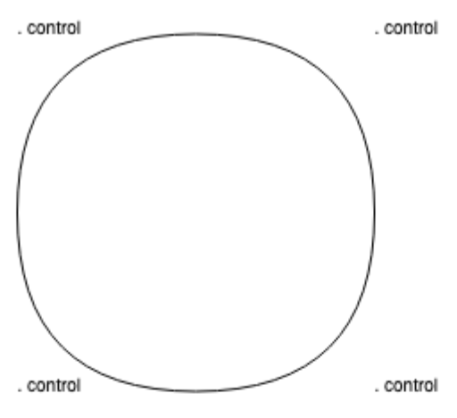

# Track Maker

This repository hosts the very beginning of a tool I intend on creating for the
purpose of being able to design 3D printable tracks to fit LED strips in. This
tool will be used to design neon-like wall logos made of these 3D printed tracks
glued onto an acrylic sheet and mounted to the wall. The LED strips fit into the
tracks and get soldered together and connected to a barrel jack a wall charger
can be plugged in to make the logo light.

## To-Do

### Implement arc between two points by specifying radius and flip

Currently I am hacking this using the `quadraticCurveTo` canvas context API
method, but it cannot create a perfect circle:

```
a 100 -100 50 false
a 100 100 50 true
a -100 100 50 false
a -100 -100 50 true
```



Using `arcTo` or a polyline with calculated midpoints would be much better. True
arc being the preferred option here as a polyline would need to accept a number
of segments to calculate. This value could default to something smooth enough,
like the larger of the two bounding box dimensions, but it would still not be
scalable like a true arc and it would generate large output files.

### Implement OpenSCAD/STL/GCode export

I am not sure if OpenSCAD can do true arcs, or STL for that matter, but GCode
does. I however further do not know if 3D printers actually implement that arc
instruction. There may be optimizations doable such that the arc is true and is
preserved in the OpenSCAD/STL and remains as such in the GCode so that the GCode
that gets generated is small and possibly even prints faster. But maybe this is
not worth the effort.

### Implement making the track thick and generating the walls holding the strips

Right now I am just drawing a stroke going through the coordinates, but the real
end goal is to draw the track thick enough to fit the LED strip as well as the
side walls that keep the LED strip in. This will require some math, so I have
not added it yet.

### Change the coordinate system to match the OpenSCAD one (reversed Y axis)

The vertical axis seems to be reversed in OpenSCAD and probably CAD in general,
so this tool should reflect that.

### Implement opening a reference to trace over from a local file

I have implemented opening references from a URL, but local file will be needed
as well.

In that case, force-open a file selector modal and once the file is selected, it
will automatically add its name as the command's argument so that it knows not
to ask for the file again - it will be in the `cache`.

If the user changes the name, the application will open the file selector modal
again letting them choose another file or cancel. Choosing a new file will make
the file name argument of the command the name of the new file. Canceling will
reset the changes the user made to the file name to the file name selected last.

Since there can be multiple references, it is important to cross-check the caret
position when a name of a local file reference is edited and when a new file is
chosen, update the argument of that reference and not the first/last reference
or something silly like that.

### Add support for optional arguments and support resizing and cropping the ref

The reference might be able to use some cropping and resizing, but it will not
always be necessary, so for good user experience, let's add support for making
some parameters in `checkArguments` optional. It will likely be enough to make
the first one as optional, but it will mean we need to check and warn when the
follow-on ones aren't marked as such. Maybe it will be better to redo the API of
the `checkArguments` method and have two arrays, one for required and one for
optional parameters. I'll need to think about the effort/gain ratios of various
options here. In the first iteration, I will likely just add the flag to every
argument and should a missing argument error come up, I will wrap that in a
condition not to check that if the argument is optional and probably short
circuit.

### Add support for local import and export to be able to preserve the models

Saving to and loading from a file should be implemented on top of the current
behavior of keeping the code stored in the local storage in the browser. This
will be parallel to the export to OpenSCAD/STL/GCode feature I am planning, the
difference being that this feature will work with the raw source code this tool
is processing.

### Display current zoom level in the status bar

Split it into parts and update only the zoom part, the other part being the
current coordinates in the CAD coordinate space for now.

### Make the viewport zoom in and out of the point at which the cursor is

Currently it zooms in and out from the origin, but I think this could be
improved.
